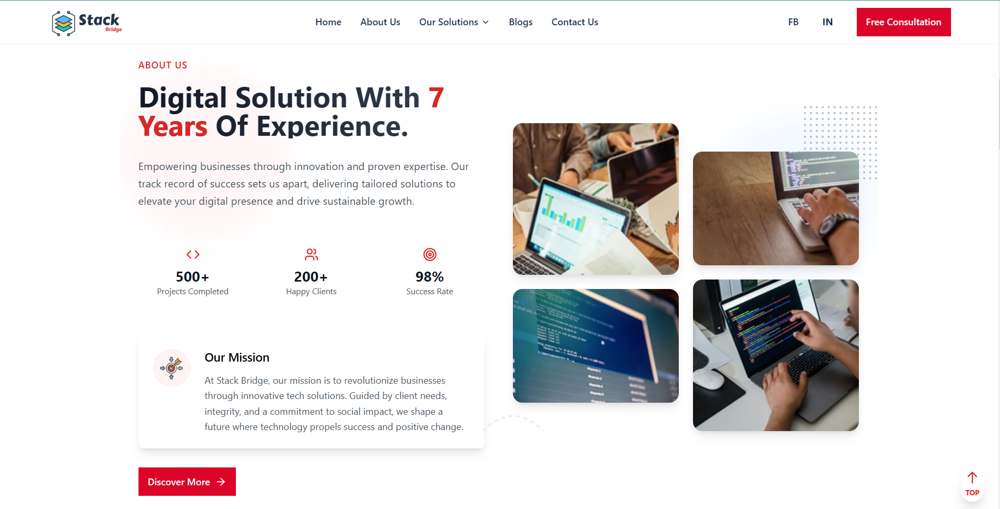

# StackBridge

StackBridge is a modern, one-page React application designed to demonstrate creativity and technical proficiency. This project leverages Vite for a fast development experience and is styled using Tailwind CSS for a sleek and responsive user interface.

### OverView



## Features

- ⚡ **Vite-Powered**: Fast builds and an optimized development environment.
- 🛠 **Modular Components**: Scalable and maintainable React components.
- 🌐 **Responsive Design**: Tailored for all screen sizes using Tailwind CSS.
- 🎨 **Clean UI**: Focused on delivering an exceptional user experience.

## Installation and Setup

To set up and run the project locally, follow these steps:

1. **Clone the repository:**

   ```bash
   git clone https://github.com/imranparthib/StackBridge.git
   ```

2. **Navigate to the project folder:**

   ```bash
   cd StackBridge
   ```

3. **Install dependencies:**

   ```bash
   npm install
   ```

4. **Run the development server:**

   ```bash
   npm run dev
   ```

5. **Open the project in your browser:** Access the app at [http://localhost:5173](http://localhost:5173).

## Technologies Used

- **React**: For building user interfaces.
- **Vite**: For a fast and efficient development environment.
- **Tailwind CSS**: For styling and responsiveness.
- **JavaScript (ES6+)**: Core language for development.

## Note

This design was inspired by Gallant Digital. While efforts were made to ensure originality, some elements may resemble the referenced website. Future updates will focus on enhancing the interface to ensure more originality.

## Future Update

**logo** will be improved
**originality** will be ensured
**Routes** Will be Completed all routes

## License

This project is licensed under the [MIT License](LICENSE).

## Contributing

Contributions are welcome! Feel free to submit issues or pull requests to enhance the project.

## Contact

For any inquiries or feedback, please reach out to [imranparthib13@gmail.com](mailto:imranparthib13@gmail.com) or visit my [LinkedIn Profile](https://www.linkedin.com/in/imranparthib/).
